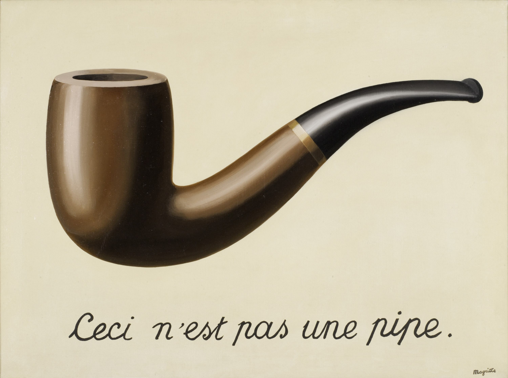

# Etiquetas básicas para dar formato  usado HTML

## Títulos y texto grande
H1: es para presentar un título de gran tamaño, su sintáxis de uso es
```text
<H1>Texto del título</H1>
```
eso se va a mostrar así:
<H1>Texto del título</H1>
o en minúscula

```text
<h1>Texto del título</h1>
```

El 1 sepuede reemplazar con números hasta el 6, pero para producir resultados visibles se recomienda usar hasta h3.

## Alineación

Si se quiere que el texto aparezca al centro

```text
<center>Texto centrado</center>
```

y lo que se muestra es:
<center>Texto centrado</center>

## Otras características

Se puede poner texto en negrita, cursiva, hacer listas, tablas, etc.

### Código

**Texto**
```text
<b>Negrita</b>
<i>Cursiva</i>
```
lo que se muestra

<b>Negrita</b>

<i>Cursiva</i>


## **Listas ordenadas**
```text
<ol>
    <li>Primero</li>
    <li>Segundo</li>
    <li>Tercero</li>
</ol>
```

Lo que se muestra

<ol>
    <li>Primero</li>
    <li>Segundo</li>
    <li>Tercero</li>
</ol>

## **Lista no ordenada**
```text
<ul>Lista no ordenada
    <li>Primero</li>
    <li>Segundo</li>
    <li>Tercero</li>
</ul>
```

Lo que se muestra
<ul>Lista no ordenada
    <li>Primero</li>
    <li>Segundo</li>
    <li>Tercero</li>
</ul>

## Enlaces

Se pueden enlazar páginas de todo internet, incluso dentro del mismo documento, pero eso no nos interesa por ahora, la estructura básica de un enlace es la siguiente:
```text
<a href="la_dirección_acá>El texto donde se pincha acá</a>
```
un enlace al buscador de google se debería escribir de la siguiente forma:
```text
<a href="https://www.google.com">Google</a>
```
y lo que se ve es lo siguiente:

<a href="https://www.google.com">Google</a>

y al pinchar sobre la palabra Google se abre la página del navegador (haga la prueba).

## Insertar imágenes

Si se necestia insertar una imagen, la forma es la siguiente:
```text

```
la "ruta a la imagen" puede ser una dirección web, la ruta a un archivo cargado en un directorio (carpeta) en el computador o acá en el repositorio, por ejemplo, la siguiente imágen se encuentra en el directorio **imagenes** en este repositorio, el código es el siguiente:
```text

```
y se muestra la imagen:


Se puede modificar el tamaño de la siguiente forma
```text

```
EXPLICACIÓN: 
width es el ancho de la imagen, se puede escribir como un número de pixeles fijo o como porcentaje, height es la altura de la imagen, al utilizar la opcio **auto** la imagen no se deforma.


Prueba cambiando el valor del porcentaje para que veas como se modifica el tamaño.

HTML es un lenguaje muy amplio, y si se mezcla con CSS y Javascript es posible construir páginas web con posibilidades infinitas, pero para el uso que le daremos, no necesitamos más por ahora.

[Volver al documento raíz](README.md)