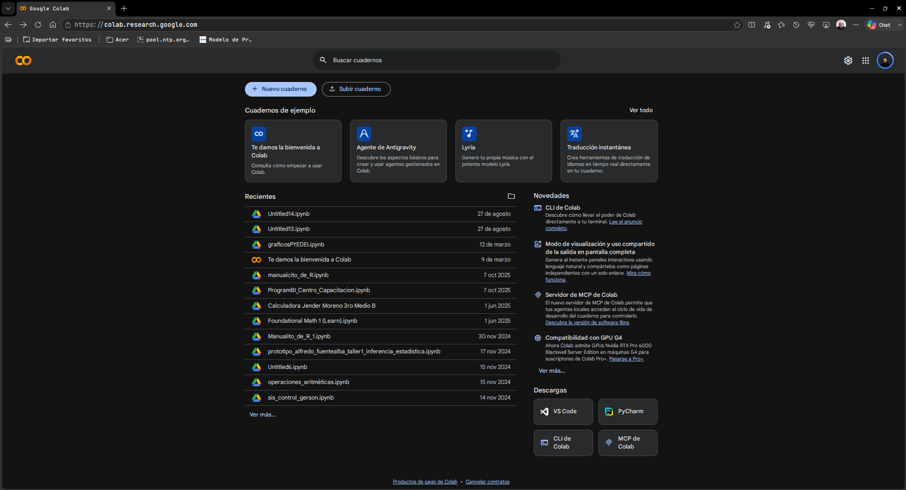
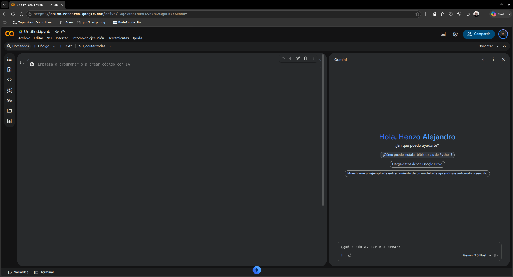
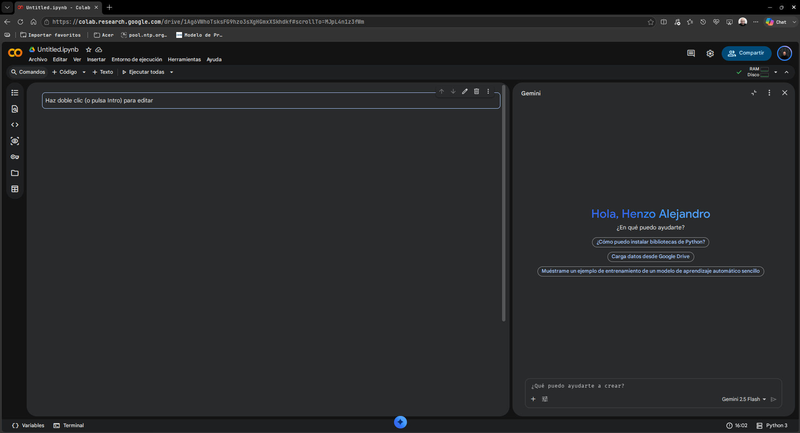

# **EN CONSTRUCCIÓN**

# Abriendo el entorno

Lo primero que debes saber es que esto funciona en base al "ecosistema de Google", por lo que es necesario tener una cuenta de Google (gmail, es gratuito) para poder utilizarlo. Una vez que tengas tu cuenta, puedes acceder a Google Colab pinchando en el siguiente enlace: [Google Colab](https://colab.research.google.com/).

La siguiente imagen muestra la pantalla de inicio de Google Colab:

Pincha en "Nuevo cuaderno" para crear un nuevo proyecto. Esto abrirá una nueva pestaña con un cuaderno en blanco donde podrás escribir y ejecutar código.

Luego pincha en "+Código" en laparte superior izquierda para crear una nueva celda de código. Esto te permitirá escribir y ejecutar código en Python.
La siguiente imagen muestra cómo se ve un cuaderno en blanco con una celda de código:

Si lo que quieres es escribir texto, puedes pinchar en "+Texto" en la parte superior izquierda para crear una nueva celda de texto. Esto te permitirá escribir texto en formato Markdown, que es un lenguaje de marcado ligero que permite dar formato al texto de manera sencilla, tambien admite código HTML y LaTeX, por lo que es muy útil para escribir ecuaciones matemáticas y fórmulas.
La siguiente imégen muestra cómo se ve un cuaderno en blanco con una celda de texto:

